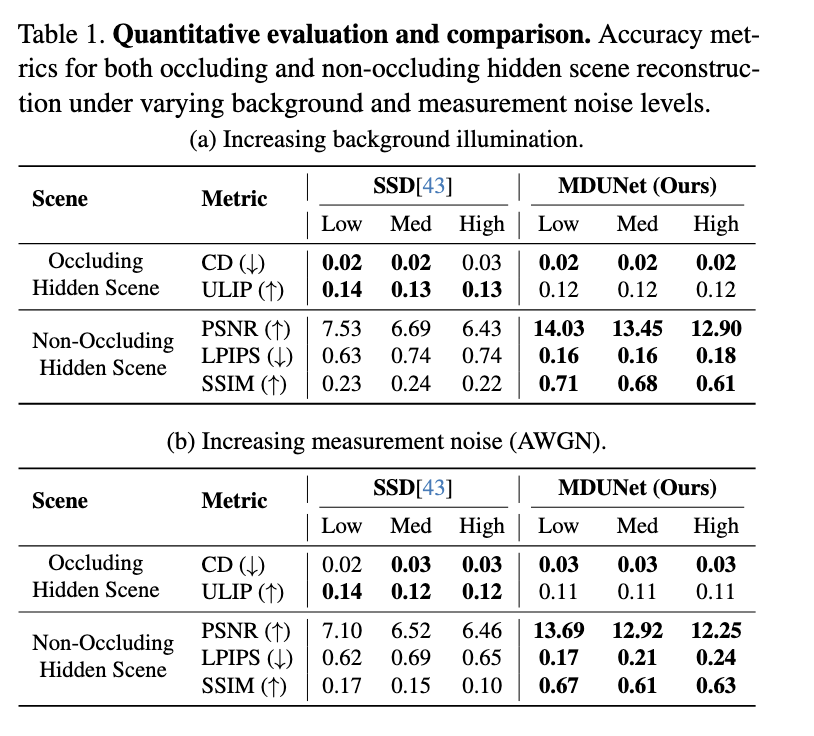
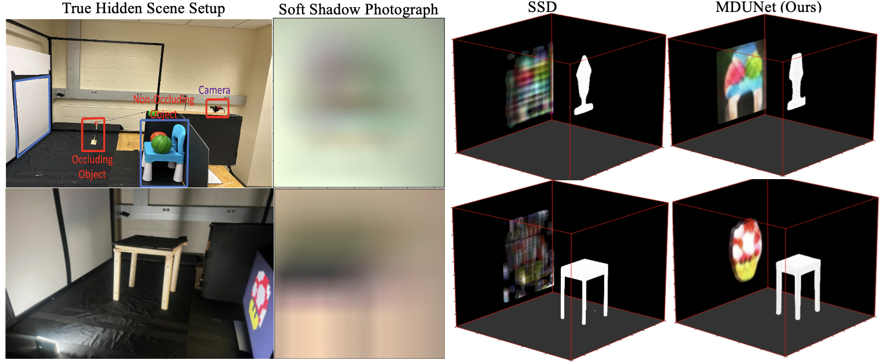

<div align='center'>
<h1>MDUNet: Multimodal Decoding UNet for Passive Occluder-Aided Non-line-of-sight 3D Imaging (WACV 2026)</h1>
<h3></h3>

[Information Science and Computational Imaging Lab, University of South Florida](https://cse.usf.edu/~murraybruce/ISCI-Lab.html)

| [Project Page](https://predstan.github.io/MDUNet/) | [Paper](https://openaccess.thecvf.com/content/WACV2026/html/Raji_MDUNet_Multimodal_Decoding_UNet_for_Passive_Occluder-Aided_Non-line-of-sight_3D_Imaging_WACV_2026_paper.html) |

</div>

<div align='center'>
  
</div>


We introduce **MDUNet**, a fully trained novel multipath decoding UNet architecture that drastically accelerates and stabilizes NLOS 3D imaging. This multimodal decoder parallels recent physics-based methods that achieve success by explicitly separating the representations and reconstructions of occluding and non-occluding hidden scene structures. By sharing a latent feature representation between the occluding and non-occluding structures, MDUNet effectively couples their reconstruction pathways.

### MDUNet excels both in the real world and simulation

<div align='center'>

</div>

### Highlights

- **MDUNet** improves inference times by over **100×** compared to diffusion-based methods (SSD) and by **1000×** compared to iterative optimization-based methods, while improving reconstruction quality.
- **MDUNet** is trained solely on simulation data but effortlessly generalizes to real experimental data, maintaining accuracy and stability even as ambient illumination increases.


### TODO


- [x] Release the inference code.
- [x] Release the evaluation code.
- [x] Release training scripts.
- [ ] Release model weights.


### Setup

**1. Create and activate a conda environment:**
```shell
conda create --name MDUNet -y python=3.9
conda activate MDUNet
```

**2. Clone the repository:**
```shell
git clone git@github.com:Predstan/MDUNet.git
cd MDUNet
```

**3. Install PyTorch (with CUDA if available):**

Visit [https://pytorch.org/get-started/locally](https://pytorch.org/get-started/locally) to get the exact command for your system. Example for CUDA 11.8:
```shell
pip install torch torchvision --index-url https://download.pytorch.org/whl/cu118
```

**4. Install MDUNet and all dependencies:**
```shell
pip install -e .
```

This installs all required packages listed in `setup.py`, including:
`pytorch-lightning`, `accelerate`, `diffusers`, `einops`, `trimesh`, `wandb`, `scikit-image`, `open3d`, `pymeshlab`, and more.

**5. (Optional) Install xFormers for faster attention:**
```shell
pip install xformers
```


### Download Model Weights

Create the `checkpoints` directory and download the model weights from Google Drive:

```shell
mkdir checkpoints
```

📥 **[Download weights from Google Drive](https://drive.google.com/drive/folders/1nsyxfwfQCCwNahumYxYH9Uu-Oa96P2X-?usp=sharing)**

Download the following files and place them in the `checkpoints/` folder:

| File | Description |
|------|-------------|
| `mdunet_1.ckpt` | Main MDUNet model weights |
| `mdunet_sdf.ckpt` | SDF VAE weights (3D mesh generation) |

Your directory should look like this:
```
mdunet/
└── checkpoints/
    ├── mdunet_1.ckpt
    └── mdunet_sdf.ckpt
```

### SDF Model
First, install the SDF model that helps us generate the 3D mesh from the pointcloud:
```shell
cd sdf_model
pip install -e .
```

### MDUNet Model
Next, install MDUNet which generates the pointcloud from shadow images:
```shell
cd ..
pip install -e .
```


### Demo
You can now run the demo script to process the hidden scenes:

```shell
python demo.py
```

By default, `demo.py` saves a static PNG snapshot for each reconstructed scene. You can control the output format using the following flags:

| Flag | Description |
|------|-------------|
| *(none)* | Save static PNG snapshot per scene (default) |
| `--save_image` | Explicitly save static PNG snapshots |
| `--save_video` | Save a rotating 360° MP4 video per scene |
| `--save_image --save_video` | Save both PNG and MP4 for each scene |

You can also override the checkpoint paths directly from the command line:

```shell
# Save rotating 360° videos
python demo.py --save_video

# Save both images and videos with custom checkpoints
python demo.py --save_image --save_video \
    --ckpt ./checkpoints/mdunet.ckpt \
    --sdf_ckpt ./checkpoints/sdf.ckpt
```

Please note that the output of the demo is a dictionary mapping. Four distinct real-world shadow photographs are provided for reconstruction. **Download the sample measurements from the original SSD repository: [SSD Measurements](https://github.com/iscilab2020/Soft-shadow-diffusion/tree/main/measurements).**

Place them in a `measurements/` folder next to the `mdunet/` directory:
```
Soft-shadow-diffusion/
├── measurements/
│   ├── ball_on_smile.pt
│   ├── ball_on_complex.pt
│   ├── random_real_ball_on_chair.pt
│   └── random_on_mush.pt
└── mdunet/
    └── demo.py
```

```python
scenes = {"ball_smiles": {"measurement": "../measurements/ball_on_smile.pt",
                          "occluder_size": (0.1, 0.1, 0.1)},
           "ball_complex": {"measurement": "../measurements/ball_on_complex.pt",
                            "occluder_size": (0.1, 0.1, 0.1)},
           "real_chair":   {"measurement": "../measurements random_real_ball_on_chair.pt",
                            "occluder_size": (0.15, 0.02, 0.22)},
           "random_mush":  {"measurement": "../measurements/random_on_mush.pt",
                            "occluder_size": (0.15, 0.02, 0.22)}}
```

After the reconstruction process, the dictionary will include new keys containing your geometry:

```python
measurements["mesh"]  = (np.asarray(mesh.vertices), np.asarray(mesh.faces))
measurements["scene"] = im.cpu().numpy()   # (H, W, 3) reconstructed 2D image
```

If you have a new measurement, include it in the same format. `.pt` measurements are processed images of shape `(1, 128, 128, 3)` saved via `torch.save(image, "m.pt")`.

As mentioned in the main paper, we use the relative size of the occluder to estimate the absolute location of the 3D object after reconstruction.
If you are only reconstructing the object casting shadows, this calculation may not be necessary.

### Training

#### Training the SDF VAE
To train the underlying implicit SDF representation which generates 3D meshes from the latent space:
```shell
python sdf_vaes.py --path_to_data /path/to/sdfs --train_batch_size 32 --epochs 2000
```
*(By default, this utilizes PyTorch Lightning DDP across multi-GPU setups).*

#### Training the MDUNet Architecture
To train the primary MDUNet framework for decoding the 2D images into multi modes 2D, and the 3D, you can use the standard python launcher:
```shell
CUDA_VISIBLE_DEVICES="0,1,2" python deepTrain.py --num_devices=3 --train_batch_size=128
```

Alternatively, you can utilize HuggingFace Accelerate for distributed data parallel scaling:
```shell
accelerate launch --multi_gpu --num_processes=3 Trainer.py --train_batch_size=64
```
